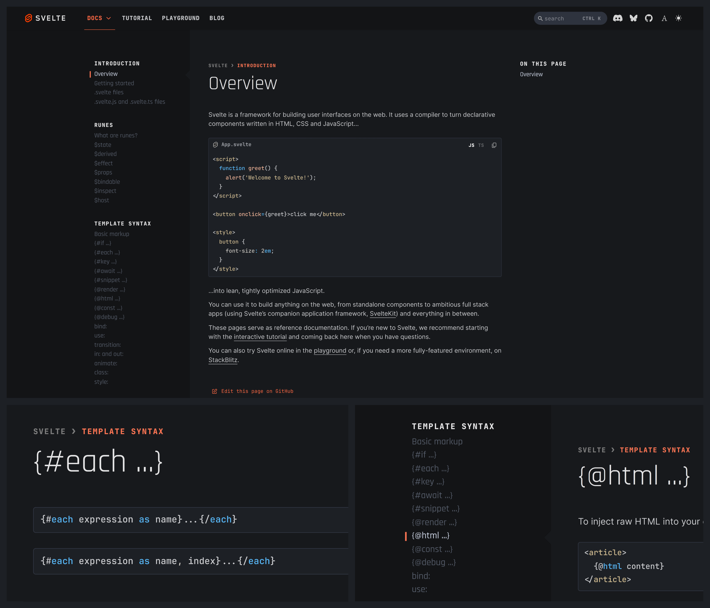

# Custom styles for Svelte.dev
The Svelte v5 website's styles are a bit too fancy and obtrusive for my taste, so I made a custom stylesheet to make it more svelte (attractively thin, graceful and stylish)

## Installation
1. Install the Stylus browser extension for your browser:
	- [**Chrome**(ium)/**Brave**](https://chrome.google.com/webstore/detail/stylus/clngdbkpkpeebahjckkjfobafhncgmne)
	- [**Firefox**](https://addons.mozilla.org/en-US/firefox/addon/styl-us/)
2. Click [here](https://raw.githubusercontent.com/Rudraksh88/svelte-dev-stylesheets/refs/heads/master/svelte-dev.user.css) to install the userstyle.
or
Copy the contents of `svelte-dev.user.css` and paste it into a new style in the Stylus extension.

## Screenshots
